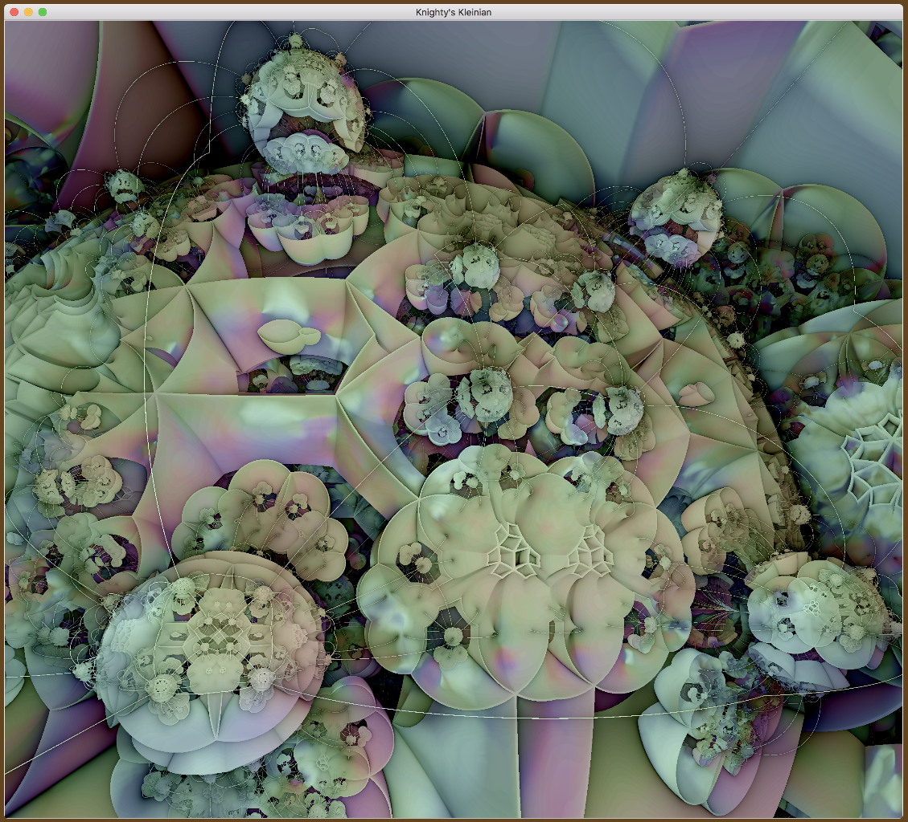
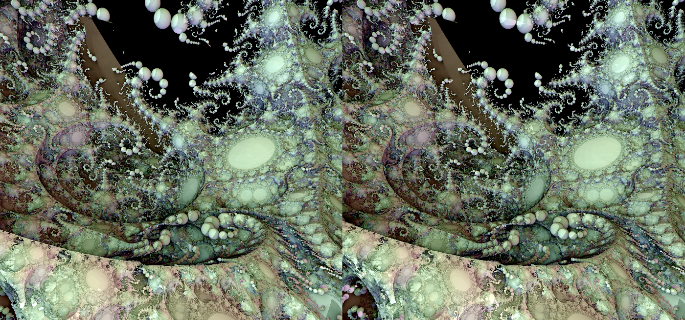
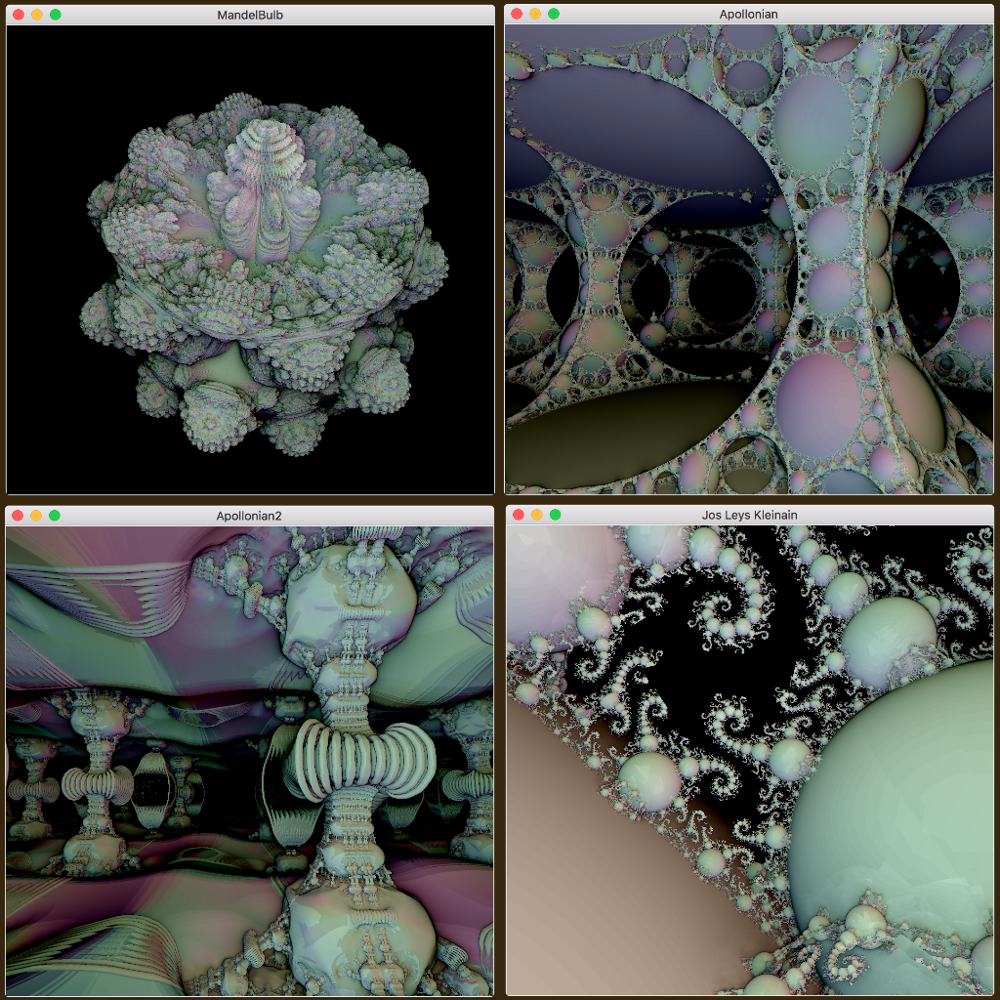
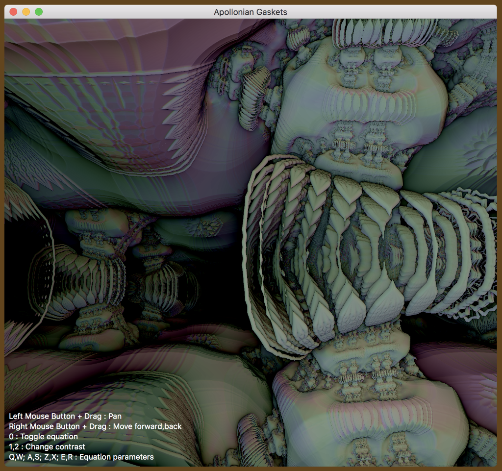

# OSX_BareBonesRayMarching
Bare bones ray marching demo for the Mac using Swift 4.2 and Metal.

It takes surprisingly few lines of code to draw a ray marching fractal with Swift and Metal. \
Here's an example..

Was originally trying to make this the smallest/simplest app I could, but couldn't resist adding \
more and more fractal equations. Finally stopped after 50 fractals.

This is still a simple app; everything about it stays the same for all the fractals. \
Just changes to the GUI to access the equation parameters, and the \
Distance Estimation routine for the RayMarching algorithm in the shader.

Update: Added video recording. \
You can define an array of keyframes that are interpolated to produce a smooth animation video.

Includes equations for fifty 3D fractals : \
 MandelBulb , Apollonian , Apollonian2 , Jos Leys Kleinian  \
 MandelBox , Quaternion Julia , Monster , Kali Tower , Polyhedral Menger  \
 Gold , Spider , Knighty's Kleinian , EvilRyu's KIFS \
 IFS Tetrahedron , IFS Octahedron , IFS Dodecahedron , IFS Menger  \
 Sierpinski Tetrahedron , Half Tetrahedron , Full Tetrahedron , Cubic  \
 Half Octahedron , Full Octahedron , Kaleidoscopic  \
 Knighty Polychora , QuadRay , 3Dickulus FragM  \
 3Dickulus Quaternion Julia , 3Dickulus Quaternion Mandelbrot  \
 Kali's MandelBox , Spudsville , Menger Smooth Polyhedra  \
 Menger Helix , Flower Hive , Jungle , Prisoner , Pupukuusikkos Spiralbox  \
 Aleksandrov MandelBulb , SurfBox , TwistBox , Kali Rontgen , Vertebrae  \
 DarkBeam Surfbox , Buffalo Bulb , Ancient Temple , Kali 3D  \
 Klienian Sponge, Floral Hybrid, Torus Knot, Donuts 

Update: Finally added OrbitTrapping colorizing effects

